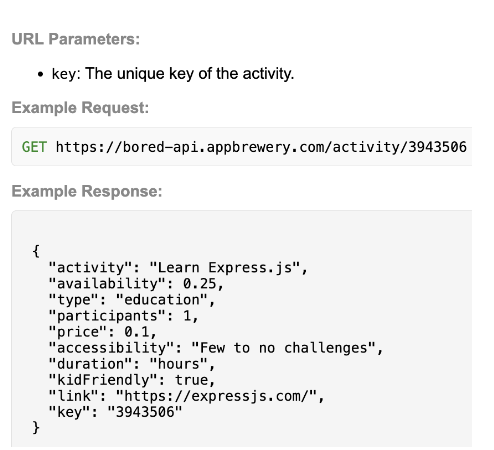
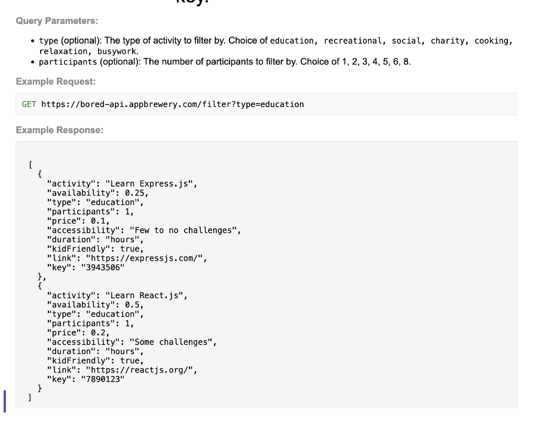

# food-API

---
## Http requests:
- GET → request resource. Getting something from server/database. 
- POST → sending a resource to the server. A form to sign up to your website, email and password is gonna be sent to your server when they click the sign-up button. Save it into a database somehow.
- PUT (update) - replace a resource with what your sending over
- PATCH (update) - patch up a resource. If there is a broken bicycle, they send a functioning wheel and I send over a functioning wheel to patch up the broken wheel. 
- DELETE - delete the resource form the server/database. 
---

https://bored-api.appbrewery.com/random?query=value&uery2=value
Base, endpoint, query value (additional parameters of request), and if I want to add more queries add an &. 

